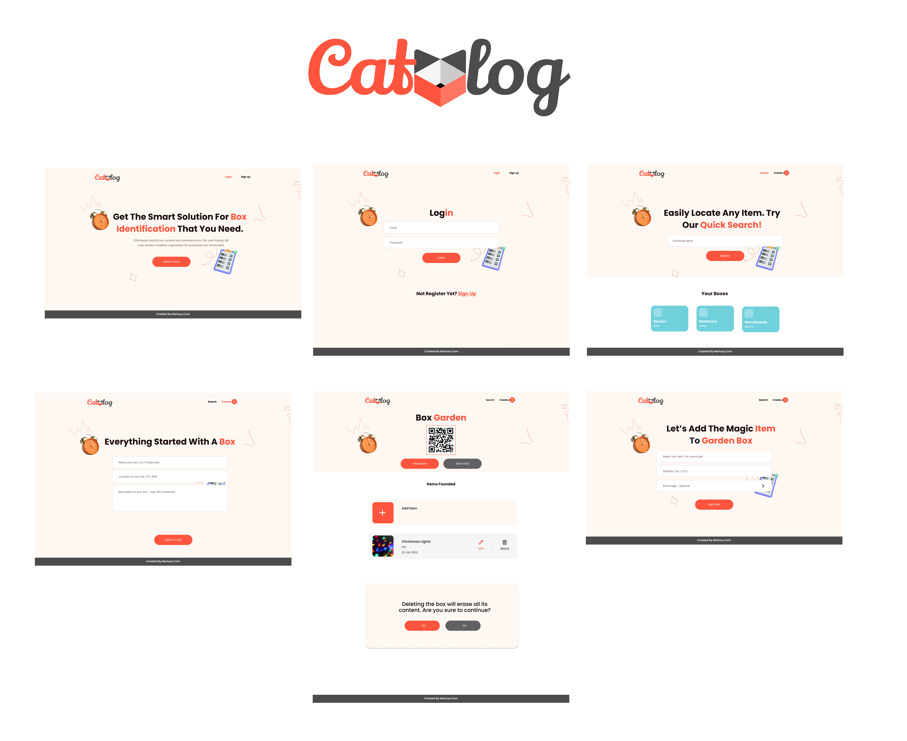

# 📦 CATALOG - QR Code Box Management Project Frontend

This repository contains the source code for the frontend of the QR code box management application. 

## Objective

**CATALOG**  - Transform your box organization with our digital solution. Easily generate QR codes through an intuitive interface, linking each box to its inventory for visual identification and optimized content control.

## 🚀 Project Description

Our app gives you the power to create a customized box organization system through an elegant visual catalog. With an intuitive interface, you'll record the complete contents of each box—including name, quantity, and images of each item—while maintaining full control to edit, delete, or add details as your organization evolves. The system automatically generates unique QR codes for each container, allowing you to instantly access your complete digital inventory with a simple scan. This feature streamlines the efficient and effortless retrieval and management of your belongings or inventory. Its exceptional adaptability makes it the ideal tool for both a small business warehouse and for organizing your storage spaces at home.

## 🛠️ Technologies Used

* **⚛️ React 15.7:** JavaScript library for building interactive user interfaces.
* **📜 JavaScript 6:** Primary programming language.
* **✨ CSS3:** Styles and visual design of the user interface. Any CSS library can be used to enhance user experience.

## 🖥️ Installation and Execution (Frontend)

To run the frontend part of this project, follow these steps:

1.  **Clone the repository:**
    ```bash
    git clone <git@github.com:cat-a-log/FrontEnd.git>
    cd frontend  # Or the folder where the frontend is located
    ```

2.  **Install dependencies:**
    ```bash
    npm install   
    ```

3.  **Configure environment variables (if necessary):**
    Create a `.env` file in the root of the frontend project and define the necessary environment variables, such as the backend API URL:
    ```
    REACT_APP_API_BASE_URL=http://localhost:5173/
    ```

4.  **Run the application:**
    ```bash
    npm run dev # Or npm start 
    ```

    This will start the frontend application in development mode. Open your browser at `http://localhost:5173` (or the URL indicated in the console).

## 🤝 Author
* **Mariuxi Olaya:**
    * GitHub: [catmaluci](https://github.com/catmaluci/)
    * LinkedIn: [Mariuxi Olaya](https://www.linkedin.com/in/molaya)
